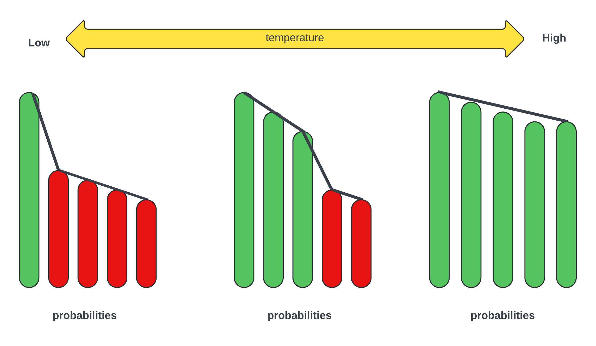
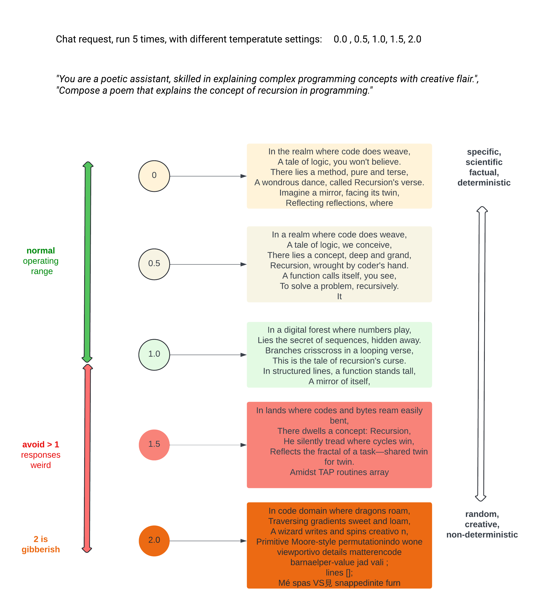

# Temperature changes
## What is temperature and how it influences the model response.

The "temperature" parameter in OpenAI's language models controls the randomness of the model's output. 

It is a key parameter that affects how creative or deterministic the generated text will be.

### Settings
Range: `0.0 to 2.0` _(nb the openai playground only allows values of 0 to 1)_

`temperature=0.1`

### Purpose: 

Controls the randomness of the output. 

Depending on the use case a different value might be required e.g. a scientist would be more specific than an author who would require more creativity.

Lower values make the output more deterministic, while higher values increase creativity, variability becoming non-deterministic.

The following table is a _guideline_ of temperature values and use cases.

| Temperature | Use Case                                                                                                                                                                               |
|-------------|----------------------------------------------------------------------------------------------------------------------------------------------------------------------------------------|
| 0.0         | Deterministic. <br/>The model always chooses the highest probability token. <br/>Use this for tasks requiring precise and consistent answers.                                          |
| 0.1 - 0.3   | Low randomness. <br/>Suitable for technical writing, <br/>factual information, <br/>and when you need high reliability.                                                                |
| 0.4 - 0.7   | Moderate randomness. <br/>Ideal for general-purpose tasks, <br/>balanced between creativity and coherence.                                                                             |
| 0.8 - 1.2   | High randomness. <br/>Good for creative writing, <br/>marketing and advertising,<br/>brainstorming, <br/>or when a variety of responses is desired.                                    |
| 1.3 - 2.0   | Use with caution. <br/>Very high randomness. <br/>Use this for highly creative tasks or exploring a wide range of possible responses. <br/>The coherence of the output might decrease. |
                                                                                                                              |
## Probability Curve

### Temperature will affect probability

A change in temperature will adjust the probabilities of the outputs generated by models, we are essentially modifying the randomness in the model's predictions. 

At a lower temperature setting, the probabilities of the outputs become more "peaky" or concentrated around the most likely token, resulting in a more deterministic selection of the next token. 

This means that the model is more confident in its predictions, as the highest probability token is more likely to be chosen.


In summary, as the temperature changes in models like OpenAI, the probabilities of the outputs either concentrate around a peak (lower temperature) or spread out more evenly (higher temperature), affecting the randomness and diversity of the generated text.

The following graph demonstrates visually the peaks and smooth curve. 
A curve with a distinct peak, will consider fewer probabilities, making the response more deterministic. 

A smoother curve, probabilities become more evenly distributed. Thereby presenting more options to consider. This increased randomness allows for more diverse and creative outputs from the model, as tokens with lower probabilities are more likely to be chosen.

Green are probabilities considered, red are not considered.



## Python Code

This is the [openai quickstart code](https://platform.openai.com/docs/quickstart), wrapped in a loop and a few parameter tweaks for this demo.

The loop will be iterated over 5 times with a different temperature setting: `0.0, 0.5, 1, 1.5, 2.0`


```Python
from openai import OpenAI
from dotenv import load_dotenv
import os

client = OpenAI()

load_dotenv()
my_api_key = os.getenv("OPENAI_API_KEY")


def run_chat_for_temperature(temperature_req: float):
    print(f"\n\nRunning chat completion with a temperature of: {temperature}")
    completion = client.chat.completions.create(
        model="gpt-4o",
        max_tokens=50,
        temperature=temperature_req,
        messages=[
            {"role": "system",
             "content": "You are a poetic assistant, skilled in explaining "
                        "complex programming concepts with creative flair."},
            {"role": "user",
             "content": "Compose a poem that explains the concept of "
                        "recursion in programming."}
        ]
    )
    print(completion.choices[0].message.content)


if __name__ == '__main__':
    for temperature in [0.0, 0.5, 1.0, 1.5, 2.0]:
        run_chat_for_temperature(temperature)

```

## Output

